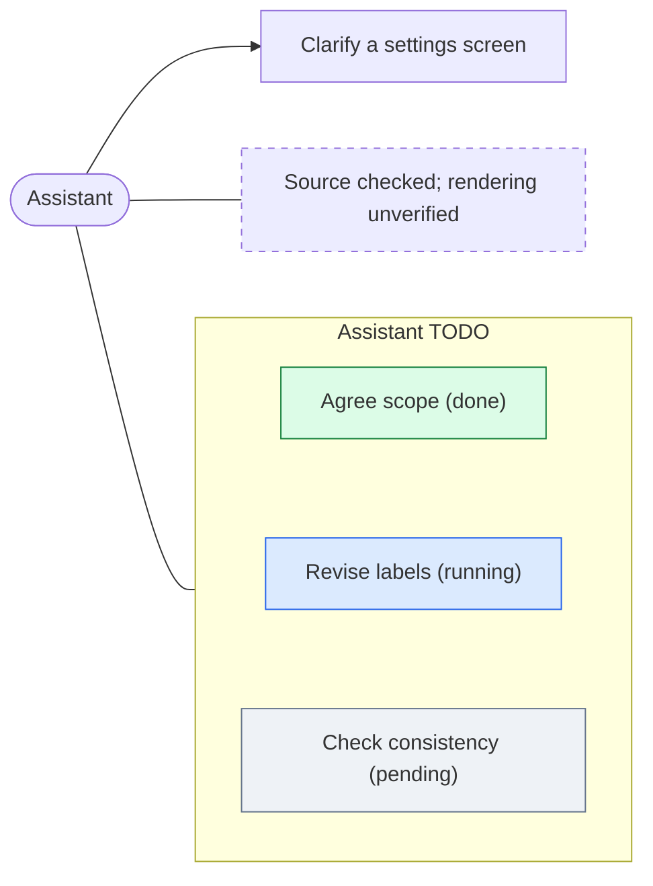

# State

```mermaid
flowchart LR
  coord(["Assistant"])
  task["Clarify a settings screen"]
  coord --> task

  subgraph todo_main ["Assistant TODO"]
    t_scope["Agree scope (done)"]:::done
    t_copy["Revise labels (running)"]:::running
    t_check["Check consistency (pending)"]:::pending
    t_scope ~~~ t_copy ~~~ t_check
  end
  coord --- todo_main

  view["Source checked; rendering unverified"]:::note
  coord --- view

  classDef pending fill:#eef2f6,stroke:#64748b
  classDef running fill:#dbeafe,stroke:#2563eb
  classDef waiting fill:#fef3c7,stroke:#b45309
  classDef blocked fill:#fee2e2,stroke:#b91c1c
  classDef done fill:#dcfce7,stroke:#15803d
  classDef note stroke-dasharray:5 5
```
