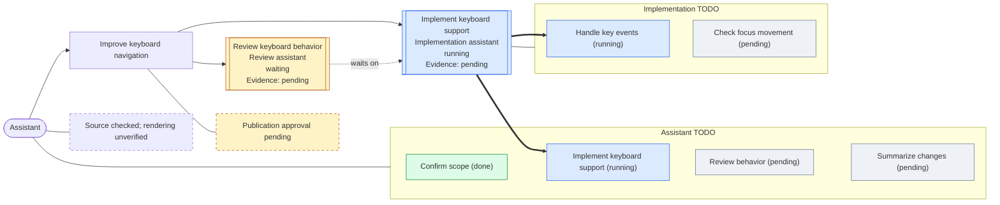

# State

```mermaid
flowchart LR
  coord(["Assistant"])
  task["Improve keyboard navigation"]
  coord --> task

  subgraph todo_main ["Assistant TODO"]
    t_scope["Confirm scope (done)"]:::done
    t_build["Implement keyboard support (running)"]:::running
    t_review["Review behavior (pending)"]:::pending
    t_report["Summarize changes (pending)"]:::pending
    t_scope ~~~ t_build ~~~ t_review ~~~ t_report
  end
  coord --- todo_main

  implement[["Implement keyboard support<br>Implementation assistant<br>running<br>Evidence: pending"]]:::running
  review[["Review keyboard behavior<br>Review assistant<br>waiting<br>Evidence: pending"]]:::waiting
  task --> implement
  task --> review
  implement ==> t_build
  review -. waits on .-> implement

  subgraph todo_implement ["Implementation TODO"]
    i_events["Handle key events (running)"]:::running
    i_tests["Check focus movement (pending)"]:::pending
    i_events ~~~ i_tests
  end
  implement --- todo_implement
  implement ==> i_events

  approval["Publication approval pending"]:::waiting
  class approval note
  task --- approval
  view["Source checked; rendering unverified"]:::note
  coord --- view

  classDef pending fill:#eef2f6,stroke:#64748b
  classDef running fill:#dbeafe,stroke:#2563eb
  classDef waiting fill:#fef3c7,stroke:#b45309
  classDef blocked fill:#fee2e2,stroke:#b91c1c
  classDef done fill:#dcfce7,stroke:#15803d
  classDef note stroke-dasharray:5 5
```
